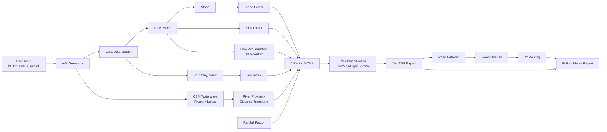

# 🌊 AI-Driven Flood Susceptibility & Evacuation Decision Support System

An automated geospatial platform that computes **6-factor flood susceptibility** using MCDA, identifies high-risk zones, overlays risk on road networks, and computes safe evacuation routes — all from a single CLI command.

---

## 📋 Table of Contents

1. [Project Overview](#1-project-overview)
2. [Problem Statement](#2-problem-statement)
3. [System Architecture](#3-system-architecture)
4. [Data Sources](#4-data-sources)
5. [Data Flow](#5-data-flow)
6. [Mathematical Model](#6-mathematical-model)
7. [Hydrological Model](#7-hydrological-model)
8. [Flood Risk Equation](#8-flood-risk-equation)
9. [Routing Algorithm](#9-routing-algorithm)
10. [Folder Structure](#10-folder-structure)
11. [Installation Guide](#11-installation-guide)
12. [Usage Guide](#12-usage-guide)
13. [Future Improvements](#13-future-improvements)

---

## 1. Project Overview

This is a **GIS-based flood susceptibility model** (not a full hydraulic simulation). Given a location and radius, the system:

- Fetches terrain (DEM) and soil data from **Google Earth Engine**
- Fetches **rivers, waterways, and water bodies** from OpenStreetMap
- Computes **flow accumulation** from DEM for drainage modelling
- Computes a **6-factor Flood Susceptibility Index** via weighted MCDA
- Classifies areas into **Low / Medium / High / Extreme** risk
- Downloads **OSM road networks** and identifies flooded segments
- Computes **A\* safe evacuation routes** to nearest shelters
- Generates an **interactive Leaflet map** and a **situation report**

---

## 2. Problem Statement

During monsoon and flood events, emergency responders need rapid answers:

- **Where** are the most flood-prone areas?
- **Which roads** are likely impassable?
- **What is the safest route** to a shelter or hospital?

Traditional flood models require hydrological expertise and days of setup. This system provides an **automated, data-driven first approximation** in minutes, using freely available global datasets.

---

## 3. System Architecture



---

## 4. Data Sources

| Layer | Source | Method | Resolution |
|-------|--------|--------|------------|
| DEM (Elevation) | USGS SRTM | GEE `USGS/SRTMGL1_003` | 30m → 250m |
| Clay Content | OpenLandMap | GEE `OpenLandMap/SOL/SOL_CLAY-WFRACTION...` | 250m |
| Sand Content | OpenLandMap | GEE `OpenLandMap/SOL/SOL_SAND-WFRACTION...` | 250m |
| Rivers/Waterways | OpenStreetMap | `osmnx.features_from_point(waterway=True)` | Vector |
| Water Bodies | OpenStreetMap | `osmnx.features_from_point(natural=water)` | Vector |
| Road Network | OpenStreetMap | `osmnx.graph_from_point()` | Vector |
| Shelters/Hospitals | OpenStreetMap | `osmnx.features_from_point()` | Vector |

All raster layers aligned to **EPSG:4326** at **250m** resolution.

---

## 5. Data Flow

```
User Input (lat, lon, radius, rainfall_mm)
    │
    ├─ GEE: SRTM DEM ──→ Downsample 30m→250m ──→ Elevation Factor (inverted)
    │                  └─→ Slope ──→ Slope Factor (inverted)
    │                  └─→ Download as numpy ──→ D8 Flow Accumulation ──→ Flow Accum Factor
    │
    ├─ GEE: Clay + Sand ──→ Soil Runoff Index
    │
    ├─ OSM: Waterways + Lakes ──→ Rasterize ──→ Distance Transform ──→ River Proximity Factor
    │
    ├─ Rainfall (user input) ──→ Rainfall Factor
    │
    └─ 6 Factors ──→ MCDA Weighted Sum ──→ Risk Raster (GeoTIFF)
                                              │
                                 OSM Roads ──→ Overlay Risk on Edges ──→ A* Safe Route
                                              │
                                         Folium Map + Situation Report
```

---

## 6. Mathematical Model

All factor layers are normalised to **[0, 1]** before combination.

### Normalisation Rules

| Factor | Formula | Logic |
|--------|---------|-------|
| Elevation | `1 − (elev − min) / (max − min)` | Lower → more risk |
| Slope | `1 − (slope − min) / (max − min)` | Flatter → more accumulation |
| Soil Index | `(clay/100 − sand/100)` rescaled `[-1,1] → [0,1]` | More clay → more runoff |
| Rainfall | `min(rainfall_mm / 300, 1)` | Linear up to 300mm |
| River Proximity | `1 − D(x)/D_max` (Euclidean distance) | Closer to water → more risk |
| Flow Accumulation | `log(1 + flow_accum)` normalised | More upstream drainage → more risk |

### Weighted Sum (MCDA)

```
FSI = w₁·Elev + w₂·Slope + w₃·Soil + w₄·Rain + w₅·River + w₆·FlowAccum
```

| Weight | Value | Justification |
|--------|-------|---------------|
| w₁ (elevation) | 0.20 | Low-lying areas collect water |
| w₂ (slope) | 0.15 | Flat terrain impedes drainage |
| w₃ (soil) | 0.15 | Clay-rich soils resist infiltration |
| w₄ (rainfall) | 0.10 | Driving force of flooding |
| w₅ (river proximity) | **0.25** | Proximity to water bodies is strongest flood predictor |
| w₆ (flow accumulation) | 0.15 | Upstream drainage concentrates water |
| **Total** | **1.00** | |

### Risk Classification (4 Classes)

| Class | FSI Range | Colour |
|-------|-----------|--------|
| Low | 0.0 – 0.3 | Green |
| Medium | 0.3 – 0.5 | Yellow |
| High | 0.5 – 0.7 | Orange |
| Extreme | 0.7 – 1.0 | Red |

---

## 7. Hydrological Model

### River Proximity Factor

Flooding is more likely near rivers, lakes, and reservoirs. The system:

1. **Fetches** waterways (`waterway=*`) and water bodies (`natural=water`) from OSM
2. **Rasterizes** features onto the 250m grid
3. **Computes** Euclidean distance transform from nearest water pixel
4. **Inverts**: `RiverFactor = 1 − D(x)/D_max` (closer = higher risk)

### Flow Accumulation Factor

Models how water concentrates as it flows downhill:

1. **Downloads** DEM as a numpy array
2. **Computes** D8 flow direction (steepest descent to one of 8 neighbours)
3. **Accumulates** upstream cell counts from highest to lowest elevation
4. **Log-normalises** to `[0, 1]` (compresses extreme values)

This captures drainage convergence that raw elevation/slope miss.

---

## 8. Flood Risk Equation

The Flood Susceptibility Index (FSI) per pixel:

```
FSI(x,y) = 0.20·E(x,y) + 0.15·S(x,y) + 0.15·Soil(x,y) + 0.10·R + 0.25·River(x,y) + 0.15·Flow(x,y)
```

Where:
- **E(x,y)** = Inverted normalised elevation
- **S(x,y)** = Inverted normalised slope
- **Soil(x,y)** = Normalised soil runoff index
- **R** = Normalised rainfall scenario (constant across AOI)
- **River(x,y)** = Inverted normalised distance to nearest water feature
- **Flow(x,y)** = Log-normalised flow accumulation

Terrain & soil factors computed server-side on GEE; hydrology factors computed locally.

---

## 9. Routing Algorithm

### A\* Shortest Path with Flood Penalty

1. **Load** the OSM drivable road network as a `networkx.MultiDiGraph`
2. **Sample** flood risk at each road segment midpoint from the risk GeoTIFF
3. **Penalise** risky edges: `edge_weight × (1 + risk × 10)`
4. **Remove** impassable edges where `risk > 0.7` (Extreme)
5. **Query** OSM for shelters/hospitals within the AOI
6. **Run A\*** with haversine heuristic → safest route to nearest reachable shelter

The heuristic ensures admissibility (haversine never overestimates) so A\* returns optimal paths.

---

## 10. Folder Structure

```
gisproj/
├── README.md                     # This file (source of truth)
├── requirements.txt              # Python dependencies
├── config.py                     # Constants, weights, thresholds
├── main.py                       # CLI entry point
├── src/
│   ├── __init__.py
│   ├── gee_data.py               # GEE auth, data fetching
│   ├── preprocessing.py          # Factor normalisation
│   ├── hydrology.py              # River proximity + flow accumulation
│   ├── flood_model.py            # MCDA risk + export
│   ├── road_network.py           # OSM roads + flood overlay
│   ├── evacuation.py             # A* routing
│   ├── visualization.py          # Folium map
│   └── decision_support.py       # Risk stats + report
├── output/                       # Generated outputs (gitignored)
│   ├── flood_risk.tif
│   ├── flood_risk_classified.tif
│   ├── flood_risk_map.html
│   └── situation_report.json
├── test/                         # Development test scripts
└── venv/                         # Virtual environment (gitignored)
```

---

## 11. Installation Guide

### Prerequisites

- Python 3.10+
- A Google Cloud project with Earth Engine API enabled
- EE authentication (`earthengine authenticate`)

### Setup

```bash
# Clone
git clone https://github.com/vishnuvardhan2704/gis.git
cd gisproj

# Virtual environment
python3 -m venv venv
source venv/bin/activate

# Dependencies
pip install -r requirements.txt

# Authenticate Earth Engine (one-time)
earthengine authenticate
```

---

## 12. Usage Guide

### Basic Run (Hyderabad, 10km radius)

```bash
python main.py
```

### Custom Parameters

```bash
python main.py \
  --lat 17.385 \
  --lon 78.4867 \
  --radius 15 \
  --rainfall 200 \
  --start-lat 17.40 \
  --start-lon 78.50
```

### Arguments

| Flag | Default | Description |
|------|---------|-------------|
| `--lat` | 17.385 | Centre latitude |
| `--lon` | 78.4867 | Centre longitude |
| `--radius` | 10 | Radius in km |
| `--rainfall` | 150 | Rainfall scenario (mm) |
| `--start-lat` | same as `--lat` | Evacuation start latitude |
| `--start-lon` | same as `--lon` | Evacuation start longitude |
| `--skip-roads` | false | Skip road & evacuation analysis |

### Outputs

| File | Description |
|------|-------------|
| `output/flood_risk.tif` | Continuous risk raster (GeoTIFF) |
| `output/flood_risk_classified.tif` | Classified risk (1–4) |
| `output/flood_risk_map.html` | Interactive Leaflet map |
| `output/situation_report.json` | Structured analytical report |

---

## 13. Future Improvements

- **Real-time rainfall** integration (GPM/CHIRPS satellite data)
- **3D terrain visualisation** via CesiumJS or `pydeck`
- **VR mode** with A-Frame for immersive risk inspection
- **Population density** overlay to prioritise evacuations
- **Machine learning** ensemble (RF/XGBoost) trained on historical flood events
- **Web dashboard** with Flask/FastAPI for non-technical users
- **Dam/reservoir proximity** as an additional flood factor
- **Time-series analysis** for seasonal flood risk changes
